# GetMyGraphicsCard
Graphics card comparison site which sends email notifications.  
Frontend repository: [Frontend](https://github.com/igh9410/GetMyGraphicsCard-Frontend)  
Final Showcase Video: [Showcase](https://youtu.be/tIaediY-c1U)  

## 📝  Tech Stack

Frontend: React Typescript (still under construction)

Backend: Java 17, Spring Boot v3, Spring Cloud, Spring Security, JPA (Hibernate), MySQL, MongoDB, Kafka, Redis

## 🧱 Server Architecture Diagram

## 🧱 Database Schema Diagram

For identity-service,  
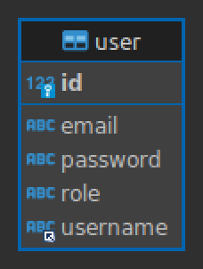

For product-service,  

For subscription-service,  
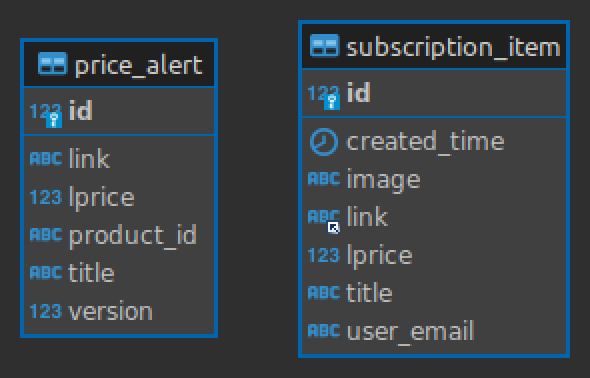

## To Run
## To Run
To run the whole microservices, Docker, JDK 17 are required.  
Intellij IDE is recommended.  
Make sure that MongoDB and MySQL is not running before the installation.  
For user convenience, databases and middlewares like MySQL, MongoDB, Redis are included in docker-compose.yml.  
If the user OS is Windows, please install Git Bash and execute the commands introduced below  
in the Git Bash terminal.  
While Docker is running, run the docker-compose file for this project by "docker-compose up -d",  
Then to initialize databases, run "./install-script.sh" or just run the sh file install-script.sh  
Execute this command in terminal after that to ensure database initialization.   
mysql -uroot -pmypassword -e "CREATE DATABASE IF NOT EXISTS identity_service; CREATE DATABASE IF NOT EXISTS subscription_service;"  

After that, the execution order of each microservice does not matter much, but I recommend running eureka-server,  
api-gateway, identity-service, product-service, subscription-service in order.  
product-service and subscription-service support launching multiple instances.

## 📝 How It Works

Users access to the app via Spring Cloud Gateway, running on port 8888.

The product service sends HTTP requests to https://shopping.naver.com, every 5 minutes, retrieving graphics card price information and saving the information to  MongoDB. It compares the item price information with previously saved data when saving the data to MongoDB. If the lowest price of a product becomes available when retrieving price information from Naver.com, the app publishes alert messages to the Kafka cluster. And users can look up the price information via /items/** endpoints.

The subscription service is another spring boot app, which deals with user management and email notification service. Multiple instances of the subscription service can be deployed in case of heavy user traffics. Users must register to use the subscription service. The user information and their subscription information are saved to the connected MySQL database. Users can add or delete items to their wishlist. The subscription service listens (subscribes) to the Kafka clusters, and saves the messages to the MySQL database. The saved messages are used as price information alert emails. The service sends the price information alert email to the users when the items on their wishlist become the lowest price available. After sending emails to the users, the subscription service deletes the messages in the MySQL database to prevent users from receiving emails regarding the same item information.

Users can have either role USER or ADMIN.
ADMIN users can perform CRUD operations on all resources of registered users.
Users with the role of USER can only perform CRUD operations on their resources.
The endpoint /subscriptions/** is secured with Spring Security. JWT is used for authentication and authorization to enhance the scalability of the app. When the user signs in to the app, the subscription service returns a JWT token which lasts 1 hour. Users can access their resources with the returned token. 

Users will receive emails like below when their items on the wishlist become the lowest price.

# 📝 API Documentation

API documentation for each service can be accessed via following URL:

identity-service: http:localhost:4000/identity/swagger-ui.html  
product-service: http:localhost:{port number for product-service}/product/swagger-ui.html  
subscription-service: http:localhost:{port number for subscription-service}/subscription/swagger-ui.html  

## Identity Service

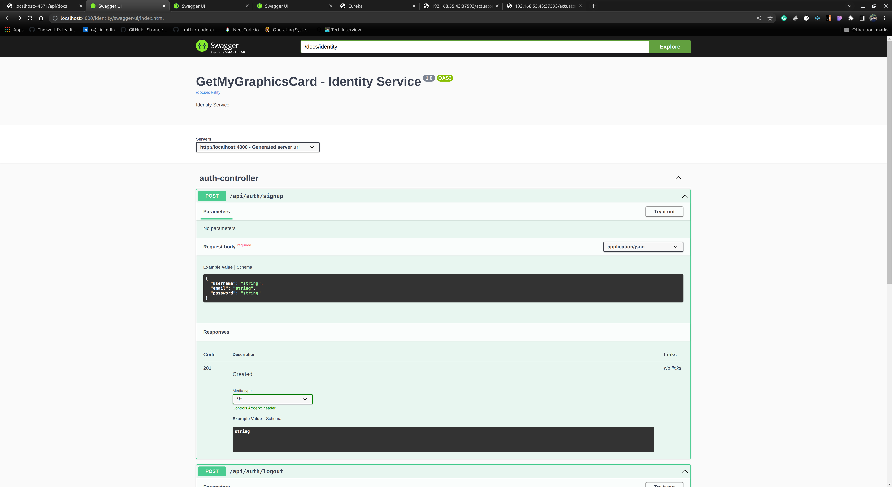  
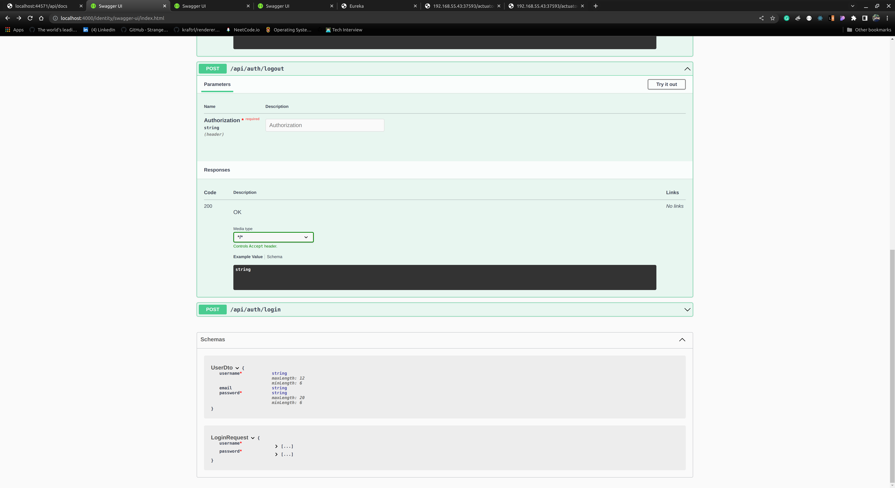  

## Product Service

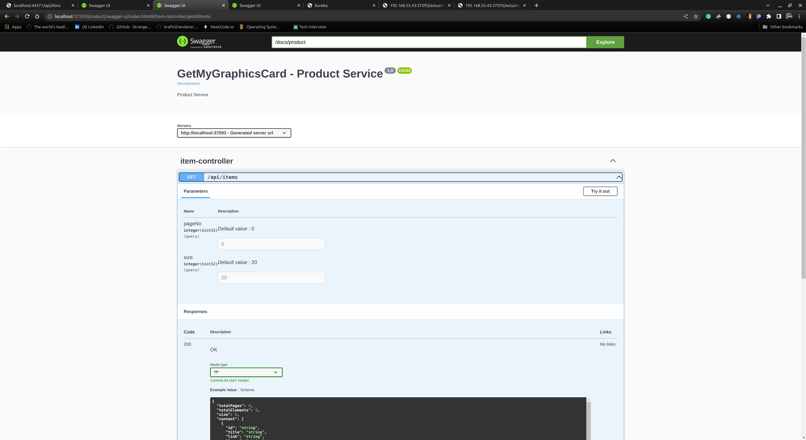  
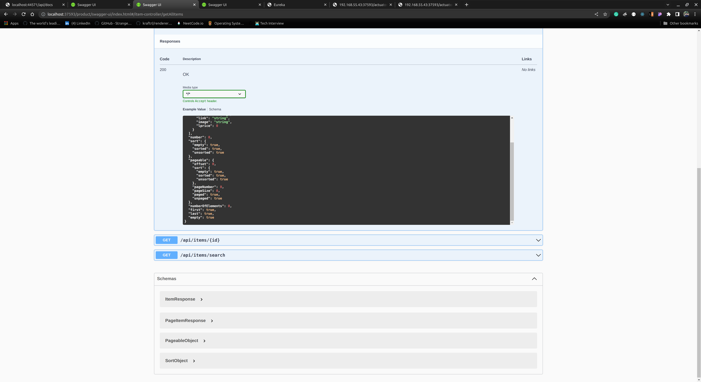  
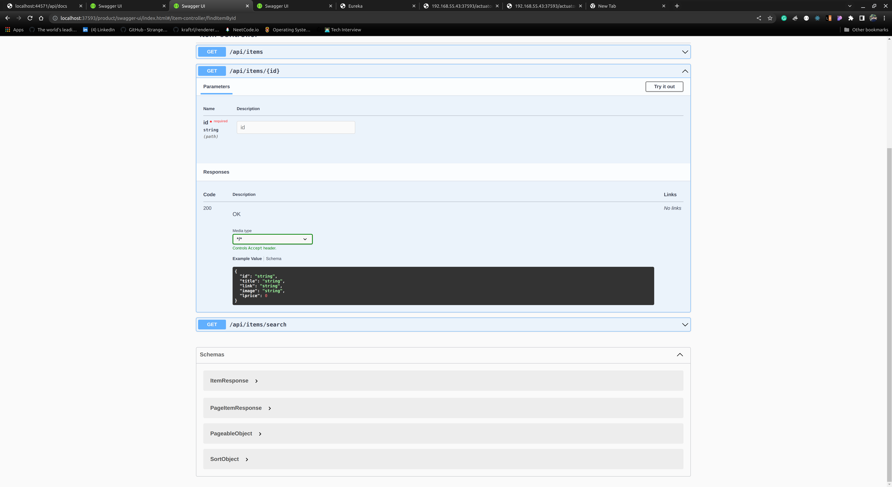  
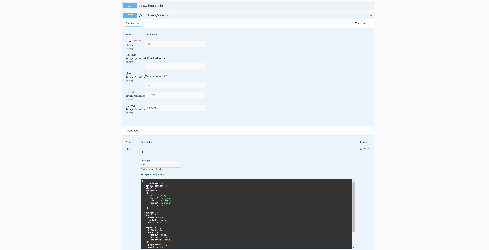  
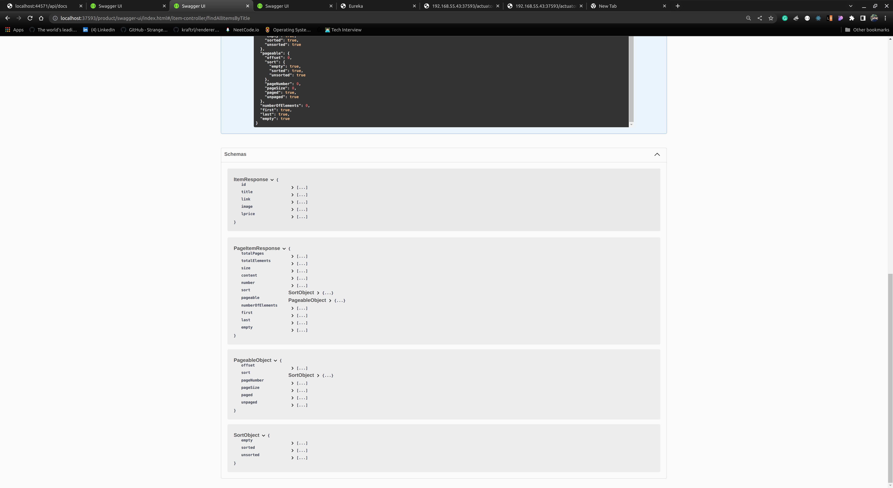  

## Subscription Service

  
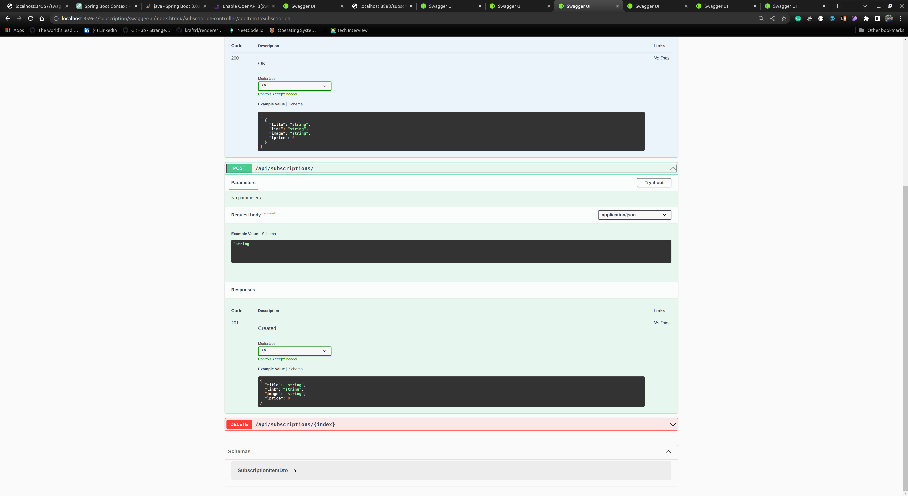  
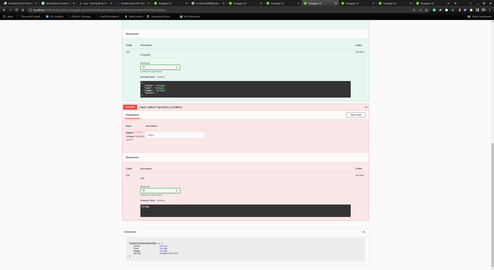  

# GetMyGraphicsCard - 한국어
실행하려면 Docker와 MySQL, MongoDB가 설치되어 실행 중이어야 합니다.
docer compose up -d로 Redis와 아파치 Kafka를 먼저 실행해주세요.
그 이후에는 각 마이크로서비스들 실행 순서는 크게 상관없으나 eureka-server,
api-gateway, identity-service, product-service, subscription
-service 순서로 실행하는 것을 권장합니다.
product-service와 subscription-service는 서버 다중화를 지원하므로 여러개의
인스턴스를 실행할 수 있습니다.

GetMyGraphicsCard 프로젝트는 스프링부트 프로젝트를 두개 생성해서 하나는
제품 서비스, 다른 하나는 구독 서비스로 분리하고 또 스프링 클라우드 API Gateway와
Eureka 서버를 배치한 구조로 만들었습니다.

제품 서비스 서버에서는 주기적으로 네이버 쇼핑 API에 HTTP 요청을 보내서 그래픽
카드들의 가격 정보를 받아와서 MongoDB에 저장합니다. 이 과정에서 그래픽카드가 저장될
때 기존의 MongoDB에 존재하던 그래픽 카드의 가격정보보다 새로 받아온 그래픽카드의
가격정보가 더 저렴할 경우, 제품 서비스 서버는 Kafka에 그래픽카드의 가격이 갱신되었다는
메시지를 발행합니다.

구독 서비스는 사용자 인증 및 권한 처리, 사용자가 관심 있는 물품을 일종의 찜목록에 추가,
삭제하는 기능을 제공합니다. 사용자가 관심 물품을 찜목록에 추가할 때 구독 서비스

서버에서 제품 서비스 서버에 HTTP 요청을 해서 제품 서비스의 MongoDB에 저장된 제품
정보를 불러온 다음, 구독 서비스 서버의 MySQL 데이터베이스에 각 사용자별 찜목록으로
저장합니다. 구독 서비스는 Kafka에서 제품 서비스가 발행하고 있는 메시지들을 구독하고
있다가 각 사용자들의 네이버 쇼핑에서 관심 품목의 최저가가 갱신되면 Kafka에서 메시지를
받아온 다음 가공해서 각 사용자들의 이메일에 알림 메일로 보내는 방식으로 작동합니다.
이때 Kafka에서 메시지를 받아온 다음, 바로 이메일을 보내려고 하면 메시지 중 상당수가
수신이 되지 않는 문제가 발생하였기에 중간에 메시지를 MySQL 데이터베이스에 저장합니다.
이후 구독 서비스에서 이메일 알림을 보내면 각 사용자가 중복되는 메일을 수신하지 않게
만들기 위해 구독 서비스의 DB에 저장된 알림 메시지들을 삭제하는 방식으로 구현했습니다.
제품 서비스에서 네이버 API에 요청을 보내는 것과 구독 서비스에서 사용자들에게 이메일을
보내는 작업은 스프링부트에서 @Scheduled 어노테이션을 추가한 일종의 cron job으로
처리했습니다.

